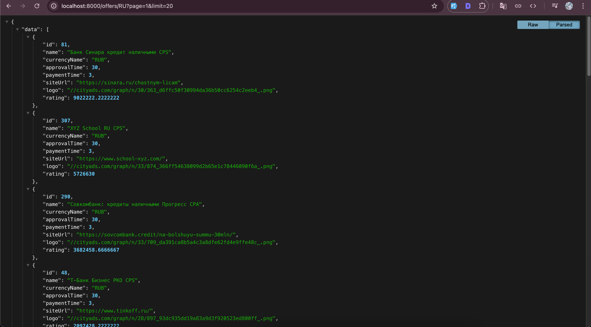
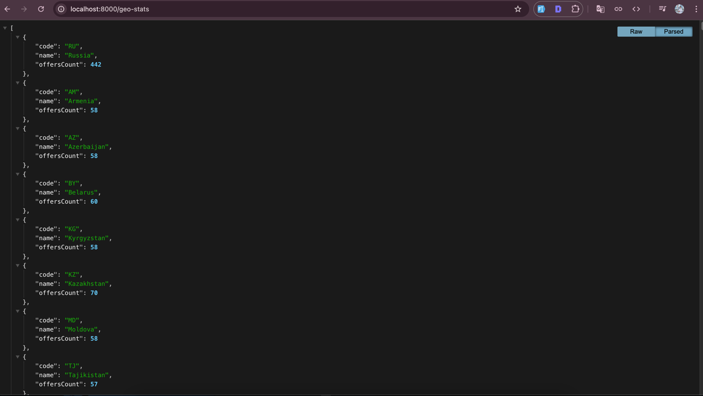

# CityAds Offers Service

Этот проект представляет собой **Symfony**‑приложение (PHP 8+), которое:

1. Синхронизирует офферы из внешнего источника (CityAds API).
2. Сохраняет их в базе данных (MySQL).
3. Предоставляет **JSON API** для получения офферов по GEO и статистики по GEO.
4. Позволяет повторно синхронизировать офферы по запросу.

## Требования

- **Docker** и **docker compose** (версии не ниже 3).
- У вас должно быть достаточно свободных портов, указанных в `docker-compose.yml` для MySQL, Nginx и phpMyAdmin.

## Установка и запуск

1. **Склонируйте репозиторий**:

   ```bash
   git clone https://github.com/orhan17/cityads.git
   cd cityads
   ```

2. Скопируйте `.env.example` в `.env` (внутри папки `src/`):
   ```bash
   cp src/.env.example src/.env
   cp .env.example .env
   ```
   
3. **Сконфигурируйте переменные окружения** в `.env`, указав данные для MySQL и прочие настройки (например, `MYSQL_ROOT_PASSWORD`, `MYSQL_DATABASE`, `MYSQL_USER`, `MYSQL_PASSWORD` и т. д.).

4. **Соберите и запустите** контейнеры:

   ```bash
   docker compose down && docker compose up --build
   ```

5. **Убедитесь**, что контейнеры поднялись:

   ```bash
   docker compose ps
   ```
   
6. **Установите зависимости**
    ```bash
    docker compose exec app bash
    composer install
    ```

7. **Зайдите в браузере** по адресу `http://localhost:8000` (если `NGINX_PORT` = 8000). Должна открыться страница вашего Symfony‑приложения (или 404, если нет дефолтного роутинга).

## Миграции БД

В проекте используется Doctrine Migrations. После запуска контейнеров выполните:

```bash
docker compose exec app bash
php bin/console make:migration
php bin/console doctrine:migrations:migrate
```

Это создаст таблицы в базе, соответствующие вашим сущностям (`Offer`, `Geo` и т. д.).

## Синхронизация офферов

1. Можно запустить вручную через эндпоинт `POST /sync-offers`.
    - Если синхронизация уже запущена, вы получите ошибку (409 или 400).

2. При необходимости (или по желанию) можно вызвать `syncOffers()` в консоли (если у вас есть консольная команда, например):
   ```bash
   docker compose exec app bash
   php bin/console app:sync-cityads
   ```
   Это подтянет данные из CityAds и сохранит их в базе (кроме тех, что с geo=Wrld).

## API-методы

1. **GET `/offers/{geo}`**
- **Параметры:**
    - `page` (int, default=1)
    - `limit` (int, default=5, max=20)
- **Описание:**  
  Отдаёт список офферов по коду GEO, отсортированных по убыванию `rating`.
- **Пример ответа:**
  ```json
  {
    "data": [
      {
        "id": 1,
        "name": "Test Offer",
        "currencyName": "RUB",
        "rating": 250.5,
        "siteUrl": "https://...",
        "logo": "//..."
      }
    ],
    "total": 1,
    "page": 1,
    "limit": 5
  }
  ```
- **Ошибки:**
    - Если нет офферов или GEO неизвестен – 404.

📷 **Пример скриншота ответа:**  


2. **GET `/geo-stats`**
- **Описание:**  
  Возвращает массив с данными по странам и количеству офферов.
  - **Пример ответа:**
    ```json
    [
      {
        "code": "RU",
        "name": "Russia",
        "offersCount": 10
      },
      {
        "code": "US",
        "name": "United States",
        "offersCount": 2
      }
    ]
    ```

  📷 **Пример скриншота ответа:**  
  

3. **POST `/sync-offers`**
    - Запускает обновление офферов из внешнего API.
    - Если синхронизация уже идёт, возвращается сообщение об ошибке.
    - При успешном запуске — `{"message":"Синхронизация завершена успешно"}`.

## Тестирование (PHPUnit)

1. **Установка** (если не установлено):
   ```bash
   docker compose exec app bash
   composer require --dev phpunit/phpunit
   ```

2. **Запуск тестов**:
   ```bash
   docker compose exec app bash
   php bin/phpunit
   ```
   Тесты могут включать:
    - **Unit-тесты** (проверка отдельных методов, без обращения к БД).
    - **Functional-тесты** (обращаются к контроллерам, используют тестовую БД).
    - **Integration-тесты** (в том числе обращаются к внешнему API CityAds).

## OpenAPI-документация

```
http://localhost:8000/docs/openapi.yml
```
и загрузить в [Swagger Editor](https://editor.swagger.io/) для визуального просмотра.

---

**Приятного использования!**

### 📩 Обратная связь
Если у вас возникли вопросы или проблемы, пишите в мой Telegram-канал: [@ahmedovorxan](https://t.me/ahmedovorxan)